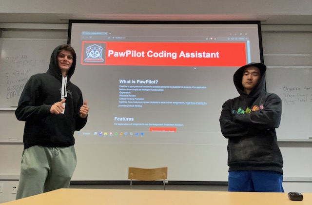

# PawHacks CHMD

## Inspiration

- **Extremely high dropout rates** in our initial fundamental classes.
- **Disparity in socioeconomic backgrounds** of people who got into coding.
- Noticed that teachers worked extremely hard but didn't always have **enough time** to help each individual student.

## What It Does

Our website is broken down into **3 simple features**:

1. **Explanation:** Allows users to paste in starter code from the teacher, breaking it down into manageable steps, teaching students how to turn a large problem into simple steps.
2. **Resources:** Provides users with easy access to resources for any assignment they are working on, helping beginners get a great initial step.
3. **Review:** Reviews users' code and provides feedback in the form of strengths/weaknesses, efficiency improvements, and things to consider for next time. It's the "take away" feature that acts like a personal tutor for the students.

## Our Roles

- **David Xiao:** Full Stack Developer
- **Hudson Kass:** Full Stack Developer
- **Caleb Harper:** Front-End Developer

## How We Built It

We split our project into two parts: **front-end** and **back-end**.

- **David** and **Hudson** initially did our research on the GPT API and how to call custom GPT's from the backend.
- **Caleb** started researching for the website design.
- We used **Node.js** to run the backend with **HTML** and **CSS** for our website.
- Spent hours on the documentation trying to learn and understand it before we saw any progress.

## Challenges We Ran Into

- The OpenAI API was extremely complicated for David and Hudson, who had limited back-end experience.
- Initially attempted to make a chrome extension but found it couldn't integrate the OpenAI API.
- Half of the team was unable to work due to unforeseen circumstances, requiring David and Hudson to complete the back-end on their own and assist Caleb with the front end.
- Disagreements occurred, but our group was always able to compromise after some discussion.

## Accomplishments That We're Proud Of

- Successfully integrating the API with each of the 3 features on our website.
- Creating a clean and modern website design.
- Making our project easy to understand/learn.
- Addressing a real-world problem, especially one that affects our community.

## What We Learned

- Always expect the unexpected.
- Things often get worse before they get better.
- Found help in the most unlikely places (GSB at 4am).
- The importance of taking short breaks when stuck.
- The value of having a plan before starting.

## What's Next for PawPilot

- Hosting the site online 24/7 so anyone can access it.
- Improving and integrating coding assistants.
- Developing our own coding assistant that dynamically helps users as they code.
- Partnering with faculty to help promote coding to everyone.

## PawPilot Awards

PawHacks 2024 AI Track Winner: [Devpost Project](https://devpost.com/software/pawhacks-chmd)

